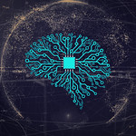

  [![Contributors][contributors-shield]][contributors-url] [![Forks][forks-shield]][forks-url] [![Stargazers][stars-shield]][stars-url] [![Issues][issues-shield]][issues-url] [![MIT License][license-shield]][license-url] [![LinkedIn][linkedin-shield]][linkedin-url]

<!-- PROJECT LOGO -->
<br />

<p align="center">
  <a href="https://github.com/vineeths96/Pattern-Recognition-2">
    
  </a>
  <h3 align="center">Pattern Recognition and Neural Networks</h3>
  <p align="center">
    Natural Language Inference (NLI) using SNLI dataset.
    <br />
    <a href=https://github.com/vineeths96/Pattern-Recognition-2><strong>Explore the repository»</strong></a>
    <br />
    <br />
    <a href=https://github.com/vineeths96/Pattern-Recognition-2/blob/master/Problem_Statement.pdf>View Problem Statement</a>
    <a href=https://github.com/vineeths96/Pattern-Recognition-2/blob/master/results/report.pdf>View Report</a>
  </p>


</p>

> tags : linear regression, logistic regression, scikit-learn, one vs rest classifier, iris dataset, German data


<!-- ABOUT THE PROJECT -->

## About The Repository

This repository holds the python implementation files for Assignment #2 for E1 213 Pattern Recognition and Neural Networks offered at the Indian Institute of Science (IISc), Bangalore. In this assignment we will explore linear models and compare different methods of learning linear classifiers and regression functions. The following methods have been implemented across the problems.

* Linear regression
* Logistic regression
* One vs Rest classification
* One hot classification

### Built With
This project was built with 

* python v3.7
* The list of libraries used for developing this project is available at [requirements.txt](requirements.txt).


<!-- GETTING STARTED -->

## Getting Started

Clone the repository into a local machine using

```shell
git clone https://github.com/vineeths96/Pattern-Recognition-2
```

### Prerequisites

Please install required libraries by running the following command (preferably within a virtual environment).

```shell
pip install -r requirements.txt
```

### Instructions to run

There are four python files - `problem_1.py`, `problem_2.py`, `problem_3.py` , and `problem_4.py` - each corresponding to the particular problem in the Problem Statement. Each problem has their corresponding implementation files under a python package with the same name. Each package has python modules and functions to load data, train a model, test it, and write the performance metrics to an output file at `./results` with the same file name. 

##### Running the program

```shell
python problem_<QUES_NUM>.py
```


<!-- LICENSE -->

## License

Distributed under the MIT License. See `LICENSE` for more information.


<!-- CONTACT -->
## Contact

Vineeth S  - vs96codes@gmail.com

Project Link: [https://github.com/vineeths96/Pattern-Recognition-2](https://github.com/vineeths96/Pattern-Recognition-2)


<!-- MARKDOWN LINKS & IMAGES -->
<!-- https://www.markdownguide.org/basic-syntax/#reference-style-links -->

[contributors-shield]: https://img.shields.io/github/contributors/vineeths96/Pattern-Recognition-2.svg?style=flat-square
[contributors-url]: https://github.com/vineeths96/Pattern-Recognition-2/graphs/contributors
[forks-shield]: https://img.shields.io/github/forks/vineeths96/Pattern-Recognition-2.svg?style=flat-square
[forks-url]: https://github.com/vineeths96/Pattern-Recognition-2/network/members
[stars-shield]: https://img.shields.io/github/stars/vineeths96/Pattern-Recognition-2.svg?style=flat-square
[stars-url]: https://github.com/vineeths96/Pattern-Recognition-2/stargazers
[issues-shield]: https://img.shields.io/github/issues/vineeths96/Pattern-Recognition-2.svg?style=flat-square
[issues-url]: https://github.com/vineeths96/Pattern-Recognition-2/issues
[license-shield]: https://img.shields.io/badge/License-MIT-yellow.svg
[license-url]: https://github.com/vineeths96/Pattern-Recognition-2/blob/master/LICENSE
[linkedin-shield]: https://img.shields.io/badge/-LinkedIn-black.svg?style=flat-square&logo=linkedin&colorB=555
[linkedin-url]: https://linkedin.com/in/vineeths

